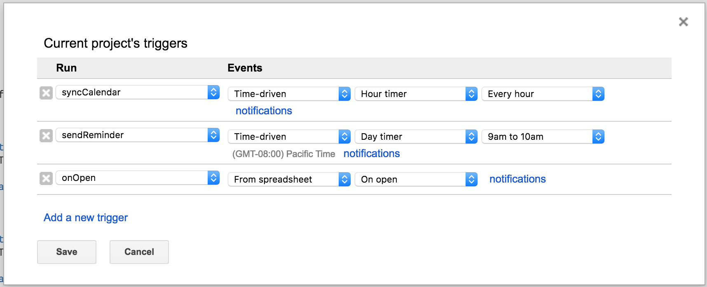

# Friday breakfast for CSE

This is the code to manage Friday breakfast at UW CSE. The code is deployed from `/cse/web/community/breakfast`. 

## Features

* Sign up in a Google Sheet
* Send reminder emails to the person who signed up
* Calendar automatically generated (and updated) from the spreadsheet
* Breakfast tally that shows how often one has brought breakfast

## How does the magic work?

All the data is hosted in a Google Sheet at https://docs.google.com/spreadsheets/d/1ofQZCbGJSaHsGjG5v7QOjtN1ksHD_tYIrw0HC17NKP8/edit. The spreadsheet has 5 sheets.

* **SignUp**: Contains the sign ups for the current quarter
* **Past** (hidden): All the past data. At the end of the quarter, the person in charge has to move data from SignUp here.
* **All** (hidden): Automatically generated. Union of the data for the current quarter and the past for the tally. This is done with `=UNIQUE({SignUp!A1:C;Past!A1:C})`.
* **Tally**: Automatically generated as a SQL query that computes the top breakfast bringers. The query is `=QUERY(All!A1:C,"select max(B), C, count(A) where B !='' and A < now() group by C order by count(A) desc label max(B) 'Name', count(A) 'Count'")`
* **Templates** (hidden): A sheet with templates for the reminder emails.

To send reminder emails and synchronize the calendar, we have a couple of [Google Apps scripts](https://developers.google.com/apps-script/).

The scripts are in a project at https://script.google.com/macros/d/M0pV2KSX5V009GYhTKLyknTqujjucHJmb/edit. A copy of the scripts are also in the scripts folder.

The functions in these scripts get run by a set of [triggers](https://developers.google.com/apps-script/guides/triggers/).

The send reminder script goes through the sign up sheet and sends an email either 1 or 4 days before the set date. The template for the email is defined in the spreadsheet.

The calendar synchronization adds or updates events in this calendar: https://goo.gl/BdOI7K. To keep track of the events, there is a hidden column in the sign up sheet with the event id.
